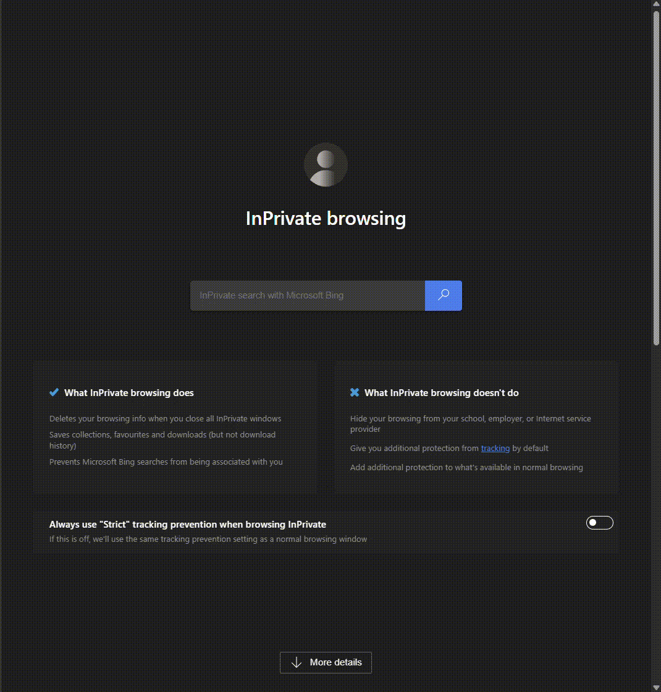

# Running Stats Full-Stack Application

This repository contains a full-stack application that tracks and visualizes running activity data. It consists of an ASP.NET Core backend API and a React frontend built with TypeScript. Together, these projects form a comprehensive solution for managing and displaying running statistics.



## Repository Structure

- **RunningStats/**  
  The ASP.NET Core backend API that exposes RESTful endpoints for retrieving and managing running activity data.  
  For more details, see [RunningStats/README.md](RunningStats/README.md).

- **RunningStats.Tests/**  
  Unit tests for the backend API, using xUnit and an in-memory database for Entity Framework Core.

- **RunningStats.IntegrationTests/**  
  Integration tests that verify the API endpoints work together correctly.

- **running-stats-frontend/**  
  The React frontend application built with TypeScript. It consumes the backend API to display activity data through lists and interactive graphs.  
  For more details, see [running-stats-frontend/README.md](running-stats-frontend/README.md).

## Getting Started

### Prerequisites

- [.NET SDK](https://dotnet.microsoft.com/download) (preferably .NET 6 or .NET 7) for the backend.
- [Node.js](https://nodejs.org/) and npm for the frontend.

### Setting Up the Project

1. **Clone the Repository:**

   ```bash
   git clone <repository-url>
   cd running-stats
   ```

2. **Backend Setup:**

   - Navigate to the backend project:
     ```bash
     cd RunningStats
     ```
   - Restore dependencies and run the API:
     ```bash
     dotnet restore
     dotnet run
     ```
   - The API will run at `http://localhost:5231`.

3. **Frontend Setup:**

   - Open a new terminal window and navigate to the frontend project:
     ```bash
     cd running-stats-frontend
     ```
   - Install dependencies and start the development server:
     ```bash
     npm install
     npm start
     ```
   - The frontend will run at `http://localhost:3000`.

## Additional Information

For more detailed setup instructions, usage information, and project specifics, please refer to the individual README files in each project folder:

- **Backend Details:** [RunningStats/README.md](RunningStats/README.md)
- **Frontend Details:** [running-stats-frontend/README.md](running-stats-frontend/README.md)


## License

This project is licensed under the MIT License.
!